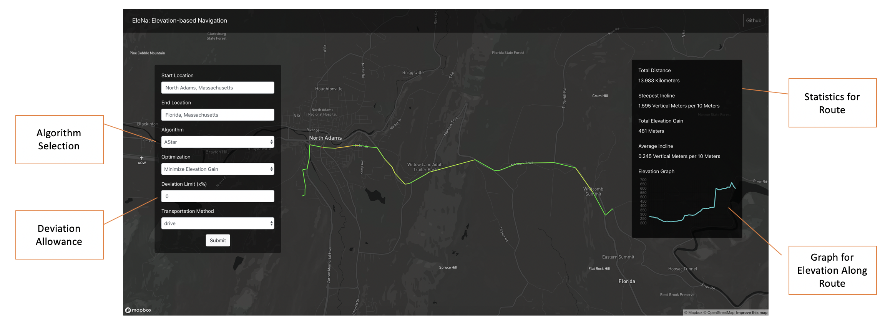

# Elevation-based Navigation: The Extended Stack
EleNa (Elevation-based Navigation) is a routing software that calculates routes based on your preference of route elevation. For example, if you wanted to get from the base of a hill to the top on a bicycle, standard shortest-path routes would make you take the steepest (but shortest) path up the hill. EleNa offers more control over the routing process, by allowing you to decide whether you want to take an easy route.

## Running Instructions
### Quick Start
In order to run Project Elena, install the required python dependencies using `pip install -r requirements.txt` in the `backend/src` directory.
- The following dependencies are needed to run EleNa:
	- osmnx
	- networkx

You must also download the following [cached-graphs.zip](https://www.dropbox.com/s/fgxt8y9eegkyqs7/cached_graphs.zip?dl=0) and unzip the file, and place all 3 pickle files in the `backend/data` directory.

Once dependencies have finished installing and you download the cached graphs, navigate to the `backend/src` directory and run `flask run` to start the backend server. The backend server serves both the api for EleNa's processing and the frontend of the webapp.

### Developing the Frontend
The frontend for EleNa is a React app. If wish to run the frontend individually in dev mode, you need to go to the `frontend` directory, then install the dependencies and run the React app. You can use the following commands to do so-
```
yarn install
yarn start
```

**Note:** If you wish to build the latest version of the frontend and run it with the Flask app, simply run the `build-frontend.sh` script from the root of the directory.


## How to use EleNa
  

